## NandGame Solutions

###### 1. Invert
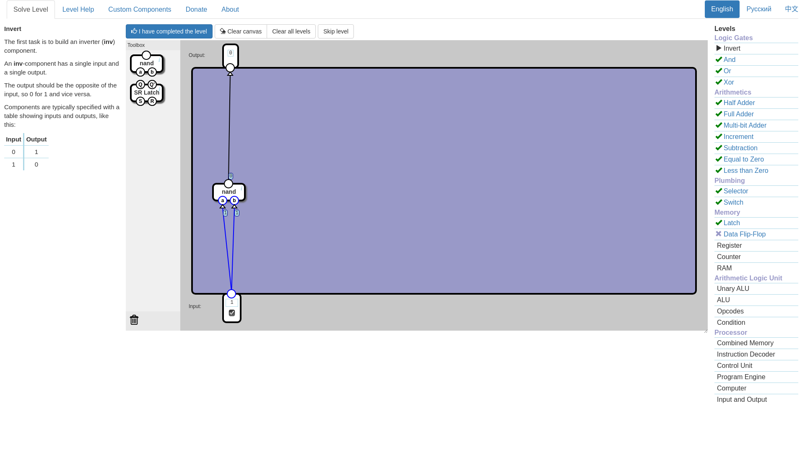
###### 2. And
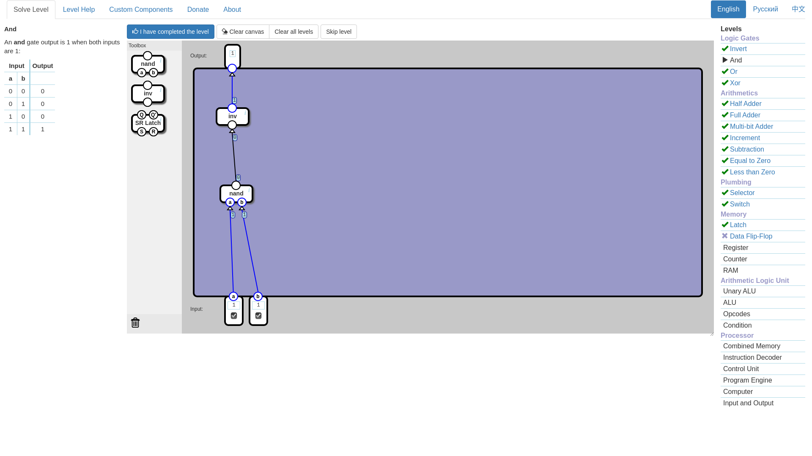
###### 3. Or
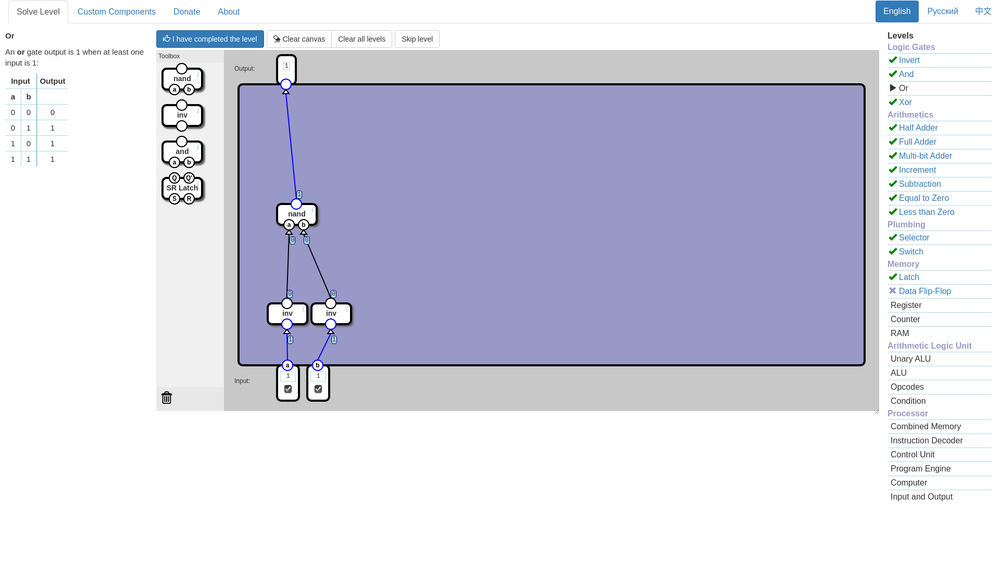
###### 4. Xor
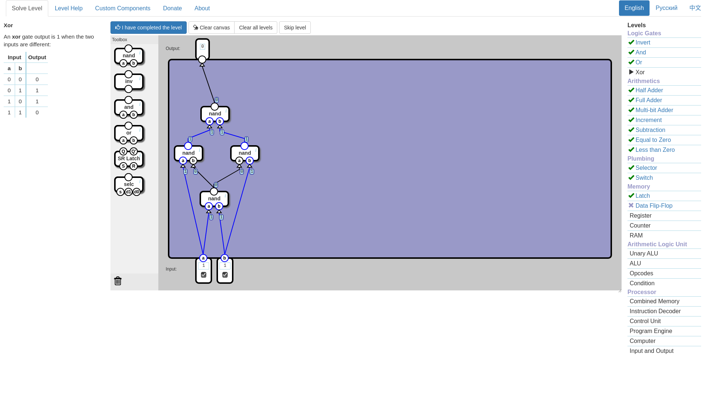
###### 5. Half Adder
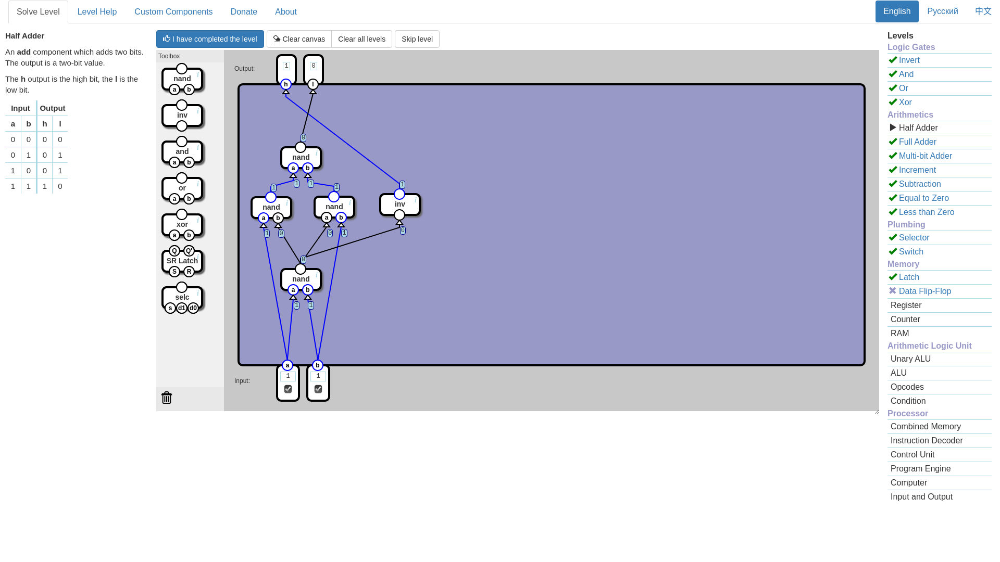
###### 6. Full Adder
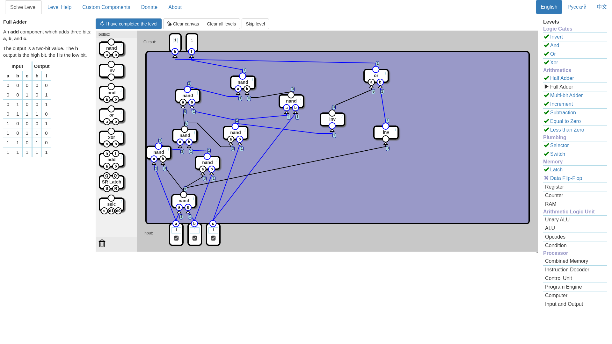
###### 7. Multi bit Adder
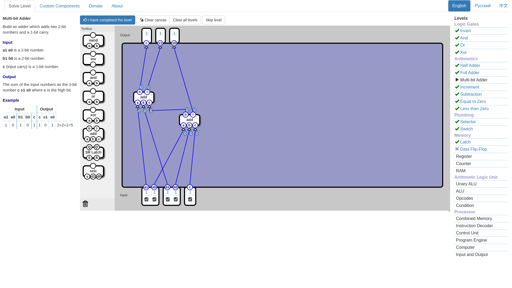
###### 8. Incrementer
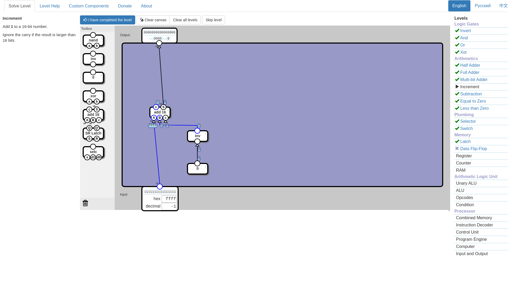
###### 9. Subtraction
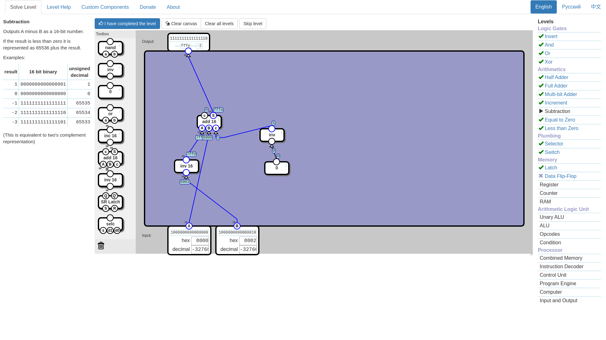
###### 10. Equal to zero
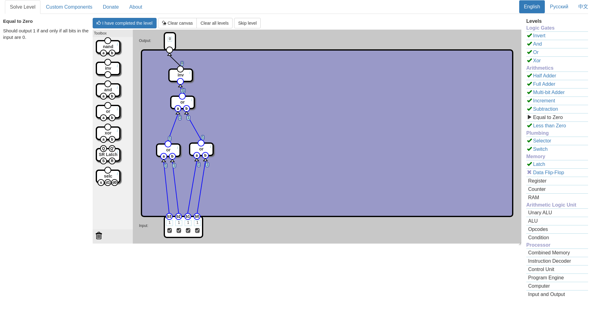
###### 11. Less than zero
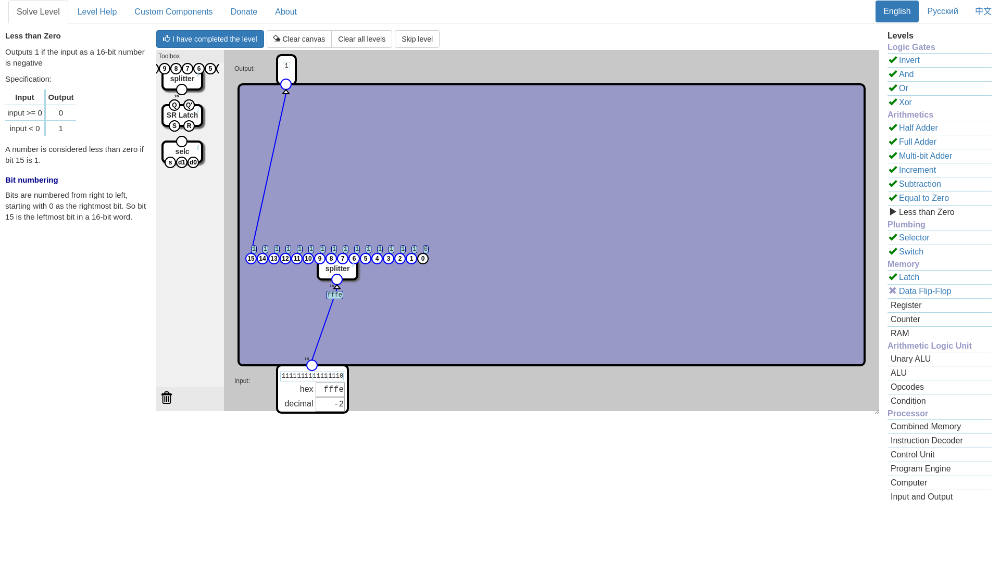
###### 12. Selector
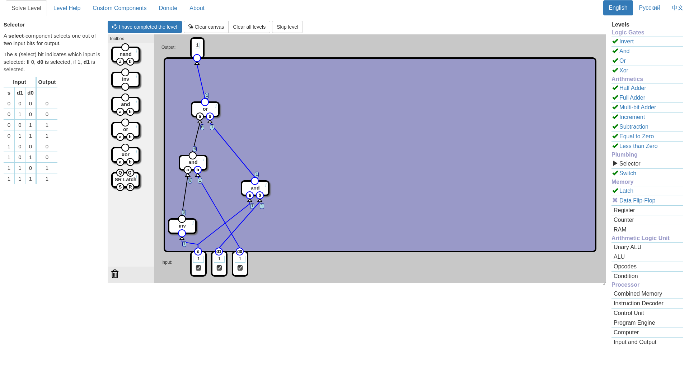
###### 13. Switch
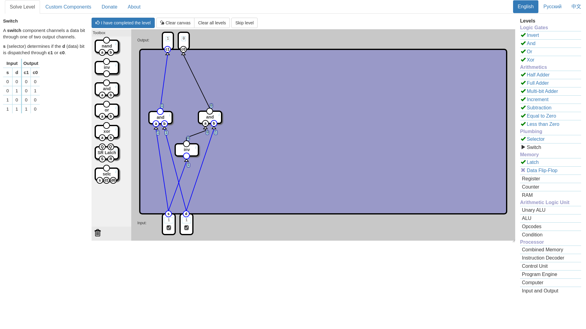
###### 14. Latch
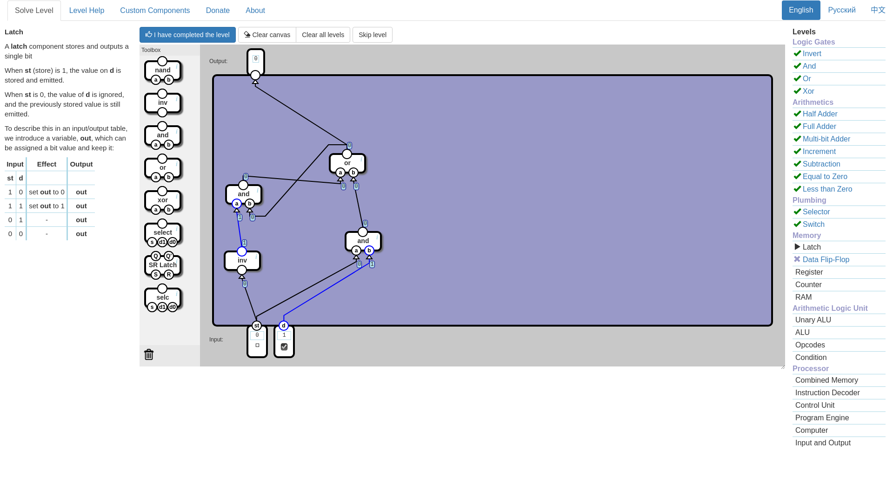
